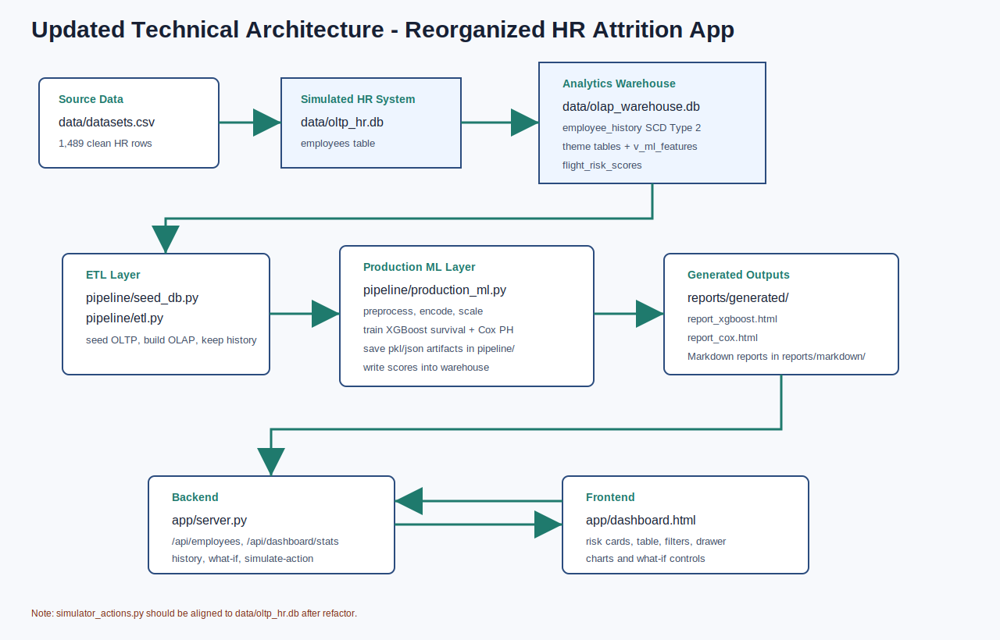
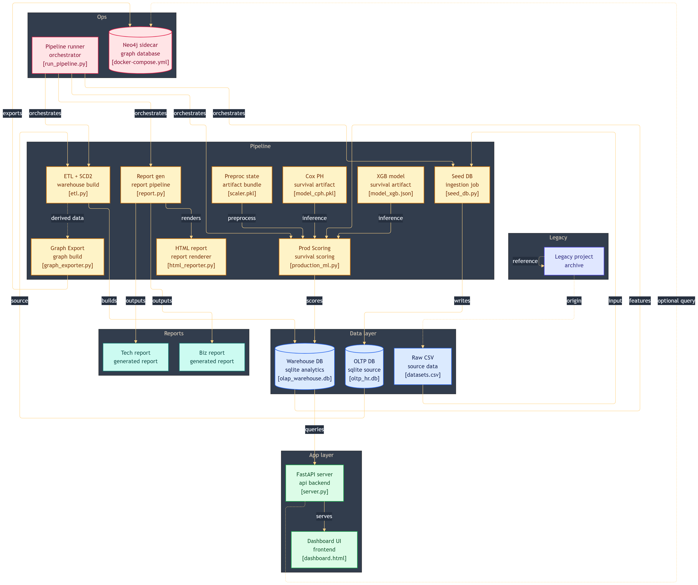
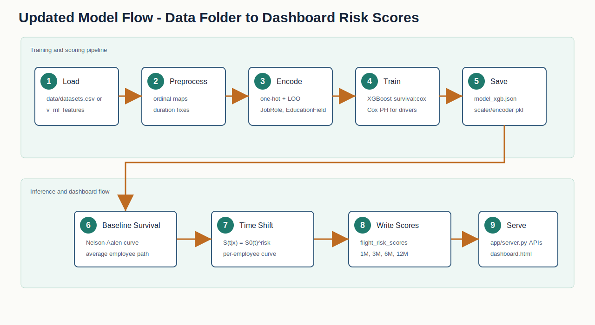

# Technical Report: HR Attrition Prediction Project

Prepared by: Fresher Intern  
Audience: MNC Technical Team  
Project: HR Attrition Risk Prediction and Dashboard  
Updated after latest folder restructuring

## 1. Project Overview

This project is an HR analytics application that predicts employee attrition risk. It reads employee data, stores it in a source HR database, moves it into an analytics warehouse, trains survival models, writes risk scores back into the warehouse, and displays the final output in a web dashboard.

The latest project structure is cleaner than before. The frontend/backend files are now inside `app/`, the dataset and SQLite databases are inside `data/`, generated model reports are inside `reports/generated/`, and the older reference project is moved into `legacy/`.

The application gives these outputs:

- 1-month leave probability
- 3-month leave probability
- 6-month leave probability
- 12-month leave probability
- General risk score
- Department-wise and employee-wise risk view
- Theme-level risk contribution
- What-if simulation for HR actions

## 2. Technology Stack

| Area | Tools Used |
|---|---|
| Language | Python |
| Data processing | pandas, numpy |
| Machine learning | XGBoost survival model, Cox Proportional Hazards |
| Survival analysis | lifelines |
| Encoding/scaling | category_encoders, scikit-learn |
| Database | SQLite |
| Backend | FastAPI |
| Frontend | HTML, CSS, JavaScript |
| Reports | Markdown, generated HTML, SVG diagrams |

## 3. Updated Project File Structure

```text
AEL Internship/
|-- app/
|   |-- server.py
|   |-- dashboard.html
|-- data/
|   |-- datasets.csv
|   |-- oltp_hr.db
|   |-- olap_warehouse.db
|-- pipeline/
|   |-- config.py
|   |-- seed_db.py
|   |-- etl.py
|   |-- data_pipeline.py
|   |-- model.py
|   |-- production_ml.py
|   |-- simulator_actions.py
|   |-- visualization.py
|   |-- report.py
|   |-- html_reporter.py
|   |-- scaler.pkl
|   |-- loo_encoder.pkl
|   |-- model_cph.pkl
|   |-- model_xgb.json
|   |-- baseline_survival.pkl
|-- reports/
|   |-- generated/
|   |   |-- report_xgboost.html
|   |   |-- report_cox.html
|   |-- markdown/
|   |   |-- Report_1_Technical_Report.md
|   |   |-- Report_2_Business_Report.md
|   |   |-- images/
|   |       |-- technical_architecture.svg
|   |       |-- model_flow.svg
|   |       |-- business_risk_charts.svg
|   |       |-- business_usage_flow.svg
|-- legacy/
|   |-- main.py
|   |-- IBM-HR-Analytics-Employee-Attrition-and-Performance-Prediction-main/
|   |-- idea reports/
|-- scratch/
|-- run_pipeline.py
|-- requirements.txt
|-- rendered_dashboard.html
```

## 4. Main Files and Responsibility

| File | Responsibility |
|---|---|
| `app/server.py` | FastAPI backend, API endpoints, model loading, what-if inference |
| `app/dashboard.html` | Main dashboard UI |
| `data/datasets.csv` | HR employee dataset |
| `data/oltp_hr.db` | Simulated source HR system database |
| `data/olap_warehouse.db` | Analytics warehouse and model output database |
| `pipeline/seed_db.py` | Seeds `data/oltp_hr.db` from `data/datasets.csv` |
| `pipeline/etl.py` | SCD Type 2 ETL from OLTP to OLAP warehouse |
| `pipeline/graph_exporter.py` | Exports employee nodes and inferred graph edges for Neo4j |
| `pipeline/init_neo4j.bat` | Helper script for loading graph CSVs into Neo4j |
| `pipeline/data_pipeline.py` | Training-time data cleaning, encoding, scaling |
| `pipeline/model.py` | XGBoost survival model and time-horizon probability logic |
| `pipeline/production_ml.py` | Production model training, scoring, artifact saving, DB writeback |
| `pipeline/html_reporter.py` | Generates HTML reports in `reports/generated/` |
| `run_pipeline.py` | Training/reporting entry point using `data/datasets.csv` |

## 5. Architecture Diagram



The full pipeline architecture reference is also stored as a PNG:



## 6. Data and Database Flow

The project follows this flow:

1. `data/datasets.csv` is used as the source dataset.
2. `pipeline/seed_db.py` creates `data/oltp_hr.db`.
3. `pipeline/etl.py` reads from OLTP and writes into `data/olap_warehouse.db`.
4. OLAP data is split into theme tables.
5. `v_ml_features` joins the latest active employee records.
6. `pipeline/production_ml.py` trains and scores active employees.
7. Scores are written to `flight_risk_scores`.
8. `pipeline/graph_exporter.py` can export `nodes.csv` and relationship CSVs for Neo4j.
9. `app/server.py` reads OLAP data and serves it to `app/dashboard.html`.

Important OLAP objects:

| Object | Use |
|---|---|
| `employee_history` | Stores SCD Type 2 employee history |
| `theme_identity` | Age, gender, marital status, education, business travel |
| `theme_environment` | Department, job role, overtime, job level, distance |
| `theme_compensation` | Monthly income, salary hike, rates, stock option |
| `theme_sentiment` | Satisfaction, involvement, work-life, performance |
| `theme_tenure` | Tenure, promotion gap, manager tenure, attrition |
| `v_ml_features` | Active ML feature view |
| `flight_risk_scores` | Final risk probabilities and contribution scores |

Graph export objects:

| Object | Use |
|---|---|
| `data/nodes.csv` | Employee graph nodes for Neo4j import |
| `data/edges_manager.csv` | Inferred SAME_MANAGER relationships |
| `data/edges_role.csv` | Inferred SAME_ROLE_DEPT relationships |
| `data/edges_tenure.csv` | Inferred SAME_TENURE_COHORT relationships |

## 7. Model Flow



The ML flow has three main stages.

Stage 1: Unified data distribution

- Load dataset or active warehouse view.
- Convert labels to numeric values.
- Encode categorical columns.
- Scale numeric features.
- Keep `YearsAtCompany` as duration and `Attrition` as event.

Stage 2: Survival model training

- XGBoost is trained with `survival:cox`.
- The model learns employee risk ranking.
- Cox PH is also trained in production for explainability.

Stage 3: Time-horizon prediction

- Nelson-Aalen estimator creates a baseline survival curve.
- XGBoost risk shifts that curve per employee.
- Final probabilities are calculated for 1, 3, 6, and 12 months.

Simple formula used:

```text
Individual Survival = Baseline Survival ^ Risk Multiplier
Attrition Probability = 1 - Individual Survival
```

Stage 4: Graph exposure support

- `pipeline/graph_exporter.py` exports a Neo4j-ready employee graph from the warehouse.
- Relationships are inferred from manager-like groups, same department/role, and tenure cohort.
- The production ML writeback does not include graph exposure as a stored feature.
- The API can query graph exposure at runtime for employee detail views and what-if inference.
- If Neo4j is unavailable, the backend returns a deterministic mock graph score so the dashboard remains usable.

## 8. Backend API Flow

Current FastAPI endpoints:

| Endpoint | Method | Purpose |
|---|---|---|
| `/` | GET | Opens `app/dashboard.html` |
| `/api/employees` | GET | Paginated employee risk list with filters and sorting |
| `/api/dashboard/stats` | GET | Dashboard summary statistics |
| `/api/employees/{employee_id}/history` | GET | Employee SCD history and historical risk |
| `/api/graph/exposure/{employee_id}` | GET | Neo4j exposure query with mock fallback |
| `/api/whatif` | POST | Temporary what-if model inference |
| `/api/simulate-action` | POST | Commits HR action, reruns ETL/ML, reloads model cache |

## 9. Frontend App Flow

The dashboard does the following:

1. Loads employee risk data from `/api/employees`.
2. Displays risk cards and employee table.
3. Supports search, department filter, status filter, sorting, and pagination.
4. Opens employee drawer for more detail.
5. Shows theme contribution bars.
6. Draws survival/risk curve.
7. Shows graph exposure context when available.
8. Calls `/api/whatif` for temporary scenario testing.
9. Calls `/api/simulate-action` when user commits an HR action.

## 10. Current Data Snapshot

Current warehouse values:

| Metric | Value |
|---|---:|
| Active employees in `v_ml_features` | 1,489 |
| Scored rows in `flight_risk_scores` | 1,489 |
| Average 1-month risk | 39.94% |
| Average 3-month risk | 47.43% |
| Average 6-month risk | 53.86% |
| Average 12-month risk | 61.21% |
| Employees above 30% high-risk threshold | 1,022 |

Department view:

| Department | Employees | Average 12-Month Risk | High-Risk Employees |
|---|---:|---:|---:|
| Human Resources | 63 | 63.04% | 44 |
| Research & Development | 975 | 63.57% | 702 |
| Sales | 451 | 55.87% | 276 |

## 11. Latest Refactor Changes Noted

The main change is folder organization:

- `server.py` and `dashboard.html` moved into `app/`.
- `datasets.csv`, `oltp_hr.db`, and `olap_warehouse.db` moved into `data/`.
- Generated HTML reports moved into `reports/generated/`.
- Markdown reports moved into `reports/markdown/`.
- Original/older project files moved into `legacy/`.
- `run_pipeline.py`, `seed_db.py`, `etl.py`, `production_ml.py`, and `app/server.py` now mostly use updated paths.
- Graph CSV exports and Neo4j sidecar support were added through `pipeline/graph_exporter.py`, `docker-compose.yml`, and `/api/graph/exposure/{employee_id}`.
- The graph signal was validated separately and is treated as contextual exposure, not as a stored training feature in `production_ml.py`.

Technical note:

- `pipeline/simulator_actions.py` still has `OLTP_PATH = "oltp_hr.db"`. After the refactor, this should ideally point to `data/oltp_hr.db`, otherwise committed simulation actions may target the wrong location depending on the working directory.

## 12. My Understanding as an Intern

I understood this project as a complete ML application, not just a notebook model. It has data engineering, model training, production scoring, APIs, and a user dashboard.

The most important learning points were:

- Survival analysis is better than simple classification when we care about time.
- SCD Type 2 helps preserve HR record history.
- Encoding must be consistent between training and what-if inference.
- Business users need probabilities and reasons, not only raw model scores.

## 13. Future Improvements

Recommended technical improvements:

- Fix `pipeline/simulator_actions.py` to use `data/oltp_hr.db`.
- Add authentication and role-based dashboard access.
- Add logs for each simulation action.
- Store model version with each score row.
- Add model drift monitoring.
- Add fairness checks before production rollout.
- Add automated tests for API endpoints and pipeline path handling.
- Add scheduled nightly ETL and ML scoring.

## 14. Conclusion

The updated project is now better organized and closer to an MNC-style proof of concept. It separates app files, data files, generated reports, markdown reports, pipeline code, and legacy material. The technical pipeline reads employee data, prepares it, trains survival models, calculates risk scores, writes them into the analytics warehouse, and exposes them through a FastAPI dashboard.
