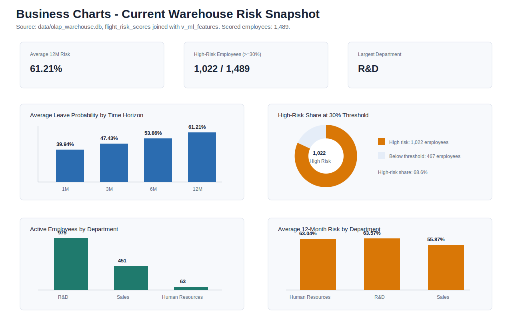
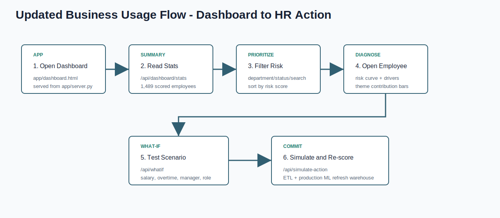

# Business Report: HR Attrition Risk Prediction Model

Prepared by: Fresher Intern  
Audience: MNC Business Heads and HR Leadership  
Project: HR Attrition Risk Prediction and Dashboard  
Updated after latest project changes

## 1. Executive Summary

This project helps HR and business leaders identify employees who may be at higher risk of leaving the company. It uses employee data such as department, job role, salary, overtime, satisfaction, work-life balance, years at company, years with manager, and promotion-related information.

The project has now been organized in a cleaner way. The dashboard is inside `app/`, the data is inside `data/`, generated reports are inside `reports/generated/`, the optional graph/Neo4j layer is separated from the core ML scoring pipeline, and an organization-network view has been added for department and reporting-structure exploration. This makes it easier for a business or technical team to understand, maintain, and audit.

Current business snapshot:

| Business Metric | Current Value |
|---|---:|
| Active employees scored | 1,489 |
| High-risk employees above 30% threshold | 1,022 |
| Average 12-month leave risk | 61.21% |
| Largest department | Research & Development |
| Main business output | Risk probability for 1M, 3M, 6M, and 12M |`r`n| New dashboard support | Organization network view with risk scores |

## 2. What Problem This Solves

Employee attrition is costly for an MNC because it can cause:

- Project delivery delays
- Client knowledge loss
- Higher hiring and replacement cost
- More workload on remaining employees
- More onboarding and training effort
- Risk in critical teams and leadership pipelines

This model works like an early warning system. It helps the company notice risk before resignation happens.

## 3. What the Model Shows

The model does not only say whether an employee may leave or not. It gives time-based risk.

| Risk Period | Business Meaning |
|---|---|
| 1 month | Immediate attention required |
| 3 months | Short-term retention action |
| 6 months | Medium-term HR planning |
| 12 months | Annual workforce planning |

This is helpful because HR teams can prioritize urgent cases separately from long-term cases.

## 4. Current Business Charts

From the current scored data:

- Average 1-month leave risk is 39.94%.
- Average 3-month leave risk is 47.43%.
- Average 6-month leave risk is 53.86%.
- Average 12-month leave risk is 61.21%.
- 1,022 out of 1,489 employees are above the 30% high-risk threshold.

## 5. Department-Level View

| Department | Employees | Average 12-Month Risk | High-Risk Employees |
|---|---:|---:|---:|
| Human Resources | 63 | 63.04% | 44 |
| Research & Development | 975 | 63.57% | 702 |
| Sales | 451 | 55.87% | 276 |

Business interpretation:

- Research & Development has the highest number of high-risk employees because it has the largest employee count.
- Human Resources and Research & Development both show high average 12-month risk, so they should be reviewed closely.
- Sales should also be watched because attrition in Sales can affect clients and revenue continuity.

## 6. How Business Teams Can Use It

Simple business usage:

1. Open the HR dashboard.
2. View total active employees and high-risk count.
3. Filter by department or high-risk status.
4. Sort employees by risk score.
5. Open employee detail drawer.
6. Check risk drivers, risk curve, and graph exposure context when available.
7. Run what-if actions like salary hike, overtime change, manager change, or promotion.
8. Decide whether HR should take action.
9. Re-score after action to see updated risk.

## 7. Business Meaning of Risk Drivers

The dashboard groups risk drivers into five themes.

| Theme | Meaning for Business |
|---|---|
| Identity | Employee background fields like age, education, gender, travel |
| Environment | Department, job role, overtime, distance, job level |
| Compensation | Salary, salary hike, stock option, pay rates |
| Sentiment | Satisfaction, work-life balance, involvement, performance |
| Tenure | Years at company, promotion gap, manager tenure, experience |

This helps HR understand the type of issue behind the risk.

Example:

- If compensation is high, salary or benefits may need review.
- If environment is high, manager, role, overtime, or team situation may need review.
- If sentiment is high, employee engagement may need action.
- If tenure is high, promotion delay or career growth may be the issue.

## 8. What-If Planning

The dashboard supports what-if checks. This means HR can test a possible action before applying it.

Examples:

| What-If Action | Business Question |
|---|---|
| Salary hike | Will better compensation reduce risk? |
| Overtime change | Does reducing overtime lower risk? |
| Manager tenure change | Could manager/team change improve risk? |
| Promotion/job role change | Would career growth reduce attrition risk? |

This is useful because it gives business leaders a data-supported way to compare retention actions.

## 9. Network Exposure Context

The project also includes an optional graph layer for understanding whether an employee is close to recently exited peers. This is not used as a stored model feature in the main production scoring table because the validation work did not prove strong contagion lift. Instead, it is used as dashboard context.

Business meaning:

| Graph Signal | Business Use |
|---|---|
| Same manager | Check team-level retention pressure |
| Same department and role | Check peer group attrition pressure |
| Same tenure cohort | Check career-stage attrition pressure |
| Recent connected exits | Understand whether risk may be socially or operationally amplified |

If Neo4j is offline, the dashboard keeps working with a mock fallback. This keeps the business demo stable while still showing where graph intelligence can fit later.`r`n`r`nThe new organization-network page gives business leaders a second way to review risk: by department hierarchy and employee network context, not only by the main table.

## 10. How This Can Help an MNC

The model can help in these areas:

| Area | Benefit |
|---|---|
| Retention planning | Focus on employees with higher risk |
| HR budgeting | Use salary/engagement budget more carefully |
| Workforce planning | Understand future attrition pressure by department |`r`n| Organization review | Inspect risk patterns across department/network structure |
| Manager review | Identify teams where environment factors may be high |
| Employee engagement | Find groups where satisfaction-related risk is visible |
| Hiring planning | Prepare replacement hiring where risk is very high |

## 11. Business Governance and Care

This model should support human decision-making. It should not become the final decision maker.

Recommended rules:

- Use the model for support and retention planning only.
- Do not punish employees based on model risk.
- Keep employee-level risk restricted to approved HR/business leaders.
- Review fairness across departments, gender, age bands, and job roles.
- Track whether HR actions actually reduce attrition over time.
- Re-train and monitor the model regularly.

## 12. Suggested MNC Rollout Plan

| Phase | Action |
|---|---|
| Phase 1 | Run pilot with HR analytics team |
| Phase 2 | Validate high-risk employees with HR business partners |
| Phase 3 | Add security, audit logs, and access control |
| Phase 4 | Connect to real HRMS source system |
| Phase 5 | Schedule monthly or weekly scoring |
| Phase 6 | Track intervention success and business impact |

## 13. Final Business Conclusion

This project can help an MNC reduce attrition risk by giving early signals to HR and business leaders. It shows who may be at risk, when the risk may happen, and what kind of factor may be contributing.

In simple words, this model helps the company act before employee attrition becomes a bigger business problem.

